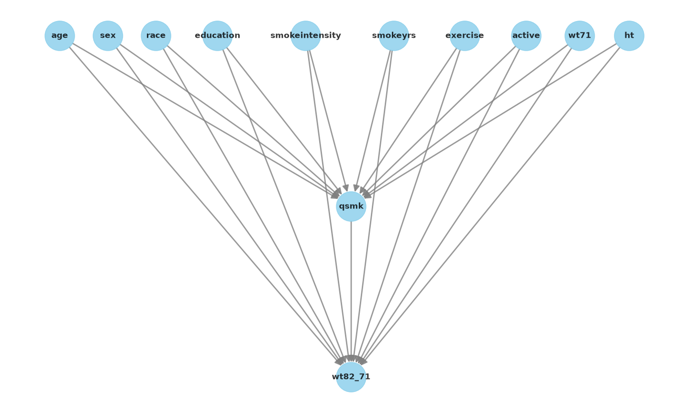

# From Correlation to Causation: Causal Machine Learning for Heterogeneous Treatment Effects


Implementing and validating core causal machine learning methods end to end: meta-learners, causal forests and formal causal identification.


Can causal ML methods reliably estimate heterogeneous treatment effects when ground truth is available, and do they produce defensible, auditable estimates when applied to real observational healthcare data? That's the question this project works through in three stages.

## The structure, and why

Before trusting a treatment-effect estimate on real data, three questions need answering:

1. Does the method work when the right answer is known? This can't be checked directly on real data, since we never observe both potential outcomes for the same person, so I validated the estimators on a semi-synthetic benchmark with known ground-truth treatment effects first.
2. Does the approach produce sensible estimates on real, confounded healthcare data?
3. Can the causal assumptions be made explicit, and does the estimate survive robustness checks?

## What's here

**`scripts/01_ihdp_benchmark.py`** benchmarks T-learner, X-learner, and Causal Forest against IHDP, a semi-synthetic benchmark with known ground-truth treatment effects, scored on PEHE across 10 repeated runs. T-learner achieved the lowest mean PEHE here, followed by X-learner and Causal Forest, but that's a result for this specific simulation setting, seed, and split, not a general claim about which method is best. IHDP results can shift with different treatment assignment mechanisms, outcome generation, or hyperparameters, so I'm treating this as one data point rather than a verdict. The point of the exercise isn't to crown a universally best estimator, it's to show that treatment-effect estimators can actually be checked against ground truth before being trusted anywhere else.

**`scripts/02_nhefs_causal_effects.py`** applies the same estimators to real data from the NHANES Epidemiologic Follow-up Study (NHEFS): does quitting smoking cause weight gain? Treatment is smoking cessation, outcome is weight change. The naive comparison gives about +2.5 kg. After adjusting for observed confounders (age, baseline weight, smoking intensity, and others), the estimate moves to roughly +3.0 to 3.5 kg depending on the method, broadly consistent with the reference estimate in Hernán & Robins' *Causal Inference: What If*. Across the four methods I ran, naive gives 2.54 kg, DoWhy's linear backdoor adjustment gives 3.34 kg, X-learner gives 3.48 kg, and Causal Forest gives 3.03 kg. That spread is itself worth sitting with: four reasonable methods, four different answers, which says something honest about how much an estimate depends on the assumptions and machinery behind it. I also looked at whether the effect varies by smoking intensity and age, and it does.

**`scripts/03_causal_dag_refutation.py`** makes the causal assumptions explicit as a DAG, uses DoWhy to identify the backdoor adjustment set, estimates the effect, and stress-tests it with two refutation tests: a placebo treatment and a random common cause. Both came back consistent with the estimate being robust to these particular checks, though that's not the same as proving the underlying assumptions are correct. A refutation test that passes tells you the estimate didn't fall apart under a specific stress test, not that the causal claim is definitively true.


**`notebooks-ready/`** has the same three scripts as notebooks, with plots.

## Running it

```bash
pip install -r requirements.txt
python scripts/01_ihdp_benchmark.py
python scripts/02_nhefs_causal_effects.py
python scripts/03_causal_dag_refutation.py
```

Both datasets are bundled in the `econml` and `causaldata` packages, so there's no separate download needed.

## Limitations, and what's next

The DAG here is deliberately simple: no mediators, no colliders. That was the right call for getting the fundamentals right, but a more complete analysis would need to separate pre-treatment confounders from post-treatment variables more carefully, since adjusting for the wrong post-treatment variable can introduce bias rather than remove it. The DAG also encodes an assumption of no unmeasured confounding, which it can't prove, only make explicit.

The refutation tests I ran (placebo treatment, random common cause) are a reasonable starting set, but stronger versions of this project would add a data-subset refuter, bootstrap resampling, and ideally a sensitivity analysis for unmeasured confounding specifically, since that's the real weak point of any observational analysis like this one.

Beyond that, the natural next step is a doubly robust estimator alongside the meta-learners and causal forest, and moving from a single treatment decision to something time-varying, since most real clinical data involves repeated measurements over time rather than one snapshot. That's a different and harder problem (marginal structural models, or something like the Causal Transformer work from Melnychuk et al.), and it's the direction I'd want to take this next.

## Reading that shaped this

- Hernán & Robins, *Causal Inference: What If*
- Facure, *Causal Inference for the Brave and True*
- Künzel et al. 2019 on meta-learners
- Wager & Athey 2018 on causal forests
